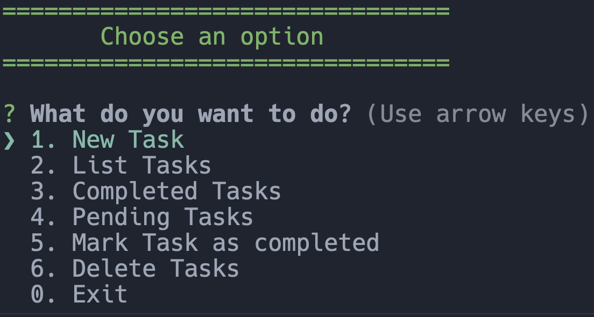
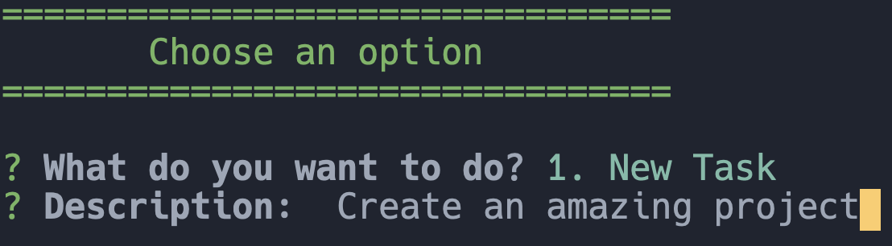
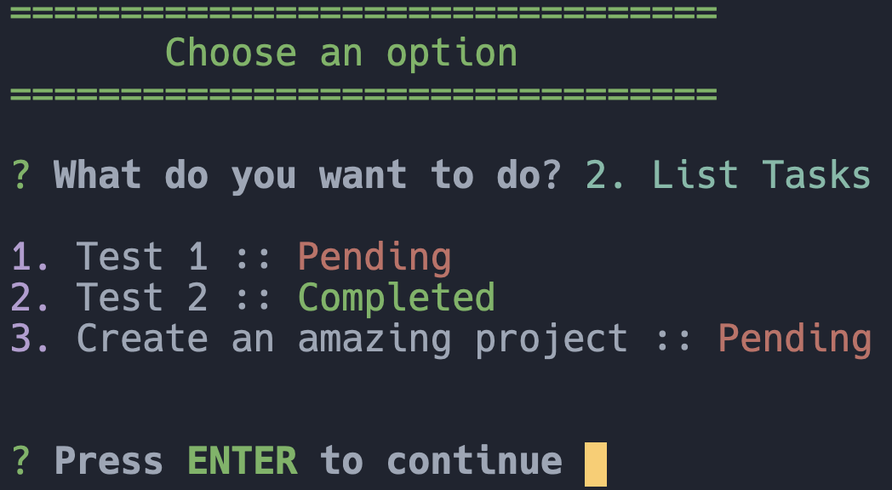
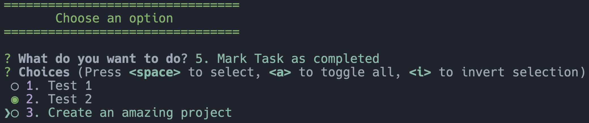

<h1 align='center'>To Do Console App ✅</h1>

## Overview 📘
To Do console app to manage tasks in a  command line interface environment.

## Screenshot 📷

## Features
- Create a new task
- Delete a task
- Edit a task
- List tasks
- Mark a task as completed

## Technologies
- Node JS
- Enquirer library